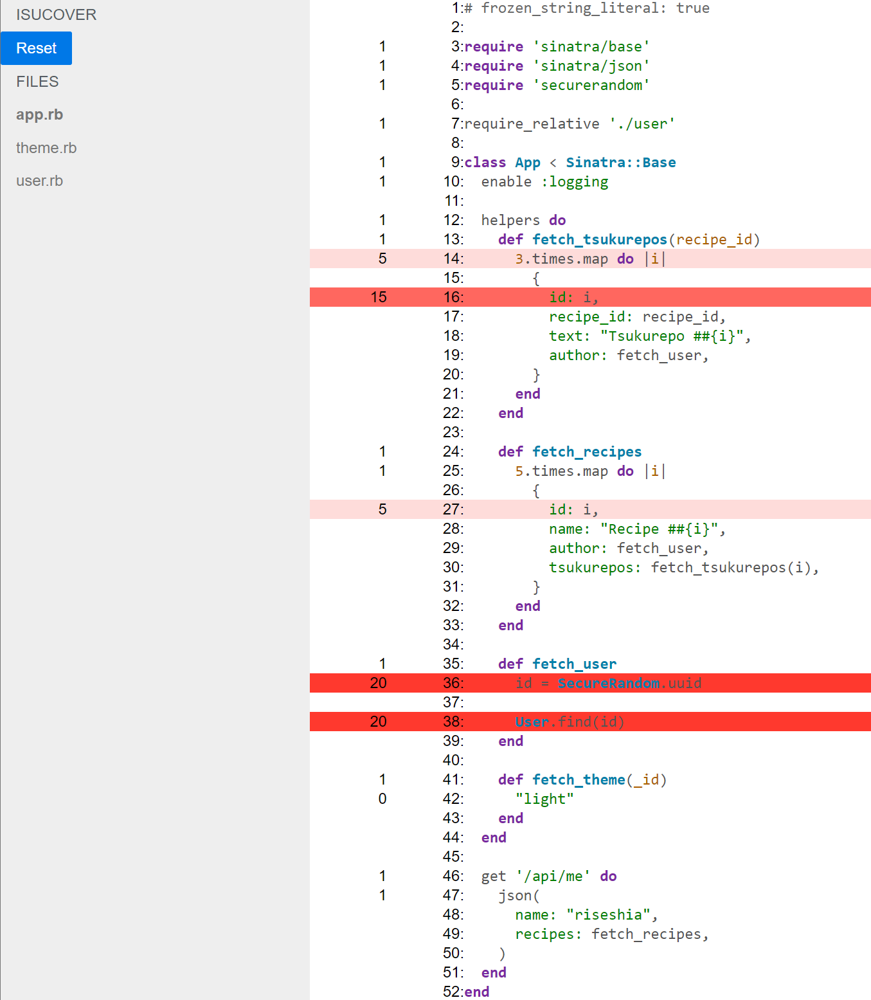

# Akainaa

Minimum rack middleware for coverage

## Installation

Install the gem and add to the application's Gemfile by executing:

    $ bundle add akainaa

If bundler is not being used to manage dependencies, install the gem by executing:

    $ gem install akainaa

## Usage

call `Akainaa.start` before your application load, and mount middleware.
Here is example:

```ruby
require 'akainaa'

Akainaa.start(project_dir: File.expand_path(__dir__))

require_relative 'app'

use Akainaa::Middleware
run App
```

Boot up application, access `/akainaa` will return coverage result like this:



## Development

After checking out the repo, run `bin/setup` to install dependencies. You can also run `bin/console` for an interactive prompt that will allow you to experiment.

To install this gem onto your local machine, run `bundle exec rake install`. To release a new version, update the version number in `version.rb`, and then run `bundle exec rake release`, which will create a git tag for the version, push git commits and the created tag, and push the `.gem` file to [rubygems.org](https://rubygems.org).

## Contributing

Bug reports and pull requests are welcome on GitHub at https://github.com/riseshia/akainaa.

## License

The gem is available as open source under the terms of the [MIT License](https://opensource.org/licenses/MIT).
