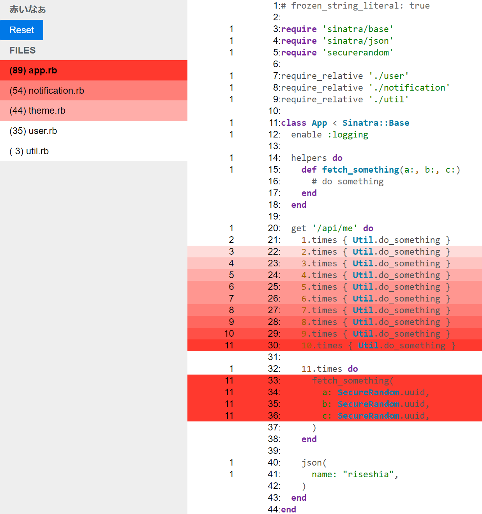

# Akainaa (赤いなぁ、 It's red...)



Akainaa is a gem to visualize code hotspot based on Coverage.
This gem can be used for the following purposes:

- super rough code profiler: The intensity of the red background for each line is proportional to the number of times it has been executed.
- A tool helps to understand what happened in a request: Akainaa have the reset button on Web UI, so user can easily record code execution for only one request.

You can see actual result view from [here](https://riseshia.github.io/akainaa/isucon13-baseline.html), which recorded on [isucon13](https://github.com/isucon/isucon13/tree/main/webapp/ruby) code in one benchmark run on [ISUNARABE](https://isunarabe.org/). And also [here](https://riseshia.github.io/akainaa/coverage/index.html) is the result of [simplecov-html](https://github.com/simplecov-ruby/simplecov-html)(0.12.3) from same coverage, so you can compare the result.

## Installation

Install the gem and add to the application's Gemfile by executing:

    $ bundle add akainaa

If bundler is not being used to manage dependencies, install the gem by executing:

    $ gem install akainaa

## Usage

call `Akainaa.start` before your application load, and mount middleware.
Here is example:

```ruby
require 'akainaa'

Akainaa.start(
  project_dir: File.expand_path(__dir__),
  ignore_glob_patterns: %w[
    config/application.rb
    config/initializers/*_initializer.rb
  ],
)

require_relative 'app'

use Akainaa::Middleware
run App
```

Boot up application, do something, and access `/akainaa`.
It will show Web UI what and how many executed.

## Development

After checking out the repo, run `bin/setup` to install dependencies. You can also run `bin/console` for an interactive prompt that will allow you to experiment.

To install this gem onto your local machine, run `bundle exec rake install`. To release a new version, update the version number in `version.rb`, and then run `bundle exec rake release`, which will create a git tag for the version, push git commits and the created tag, and push the `.gem` file to [rubygems.org](https://rubygems.org).

## Contributing

Bug reports and pull requests are welcome on GitHub at https://github.com/riseshia/akainaa.

## License

The gem is available as open source under the terms of the [MIT License](https://opensource.org/licenses/MIT).
